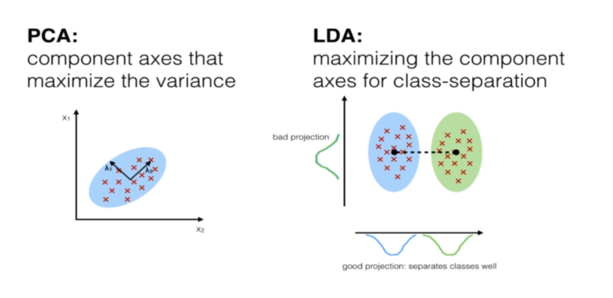

### LINEAR DISCRIMINANT ANALYSIS - Supervised Algorithm

- Used as a dimentionality reduction technique.
- Used in the preprocessing step for pattern classification.
- Has a goal to project a dataset onto a lower dimentional space.

1. Sounds similar to PCA right?
    LDA differs because in addition to finding the component axises with LDA we are interested in the axes that maximize the seperation between multiple classses.

2. Breaking it down further:
    - The goal of LDA is to project a feature space (a dataset n-dimentioanl sample) onto a small subspace k (where k<=n-1) while maintaining the class discriminatory information.
    - Both PCA and LDA are linear transformation techniques used for dimentional reduction. PCA is described as unsupervised but LDA is supervised because of the relation to the dependent variable.

